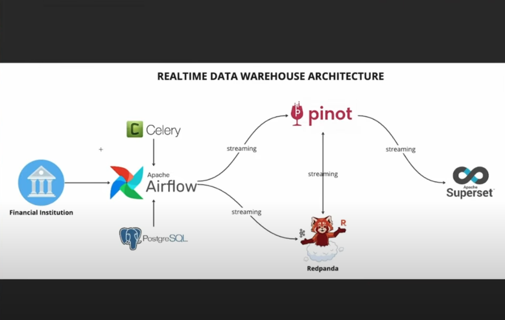
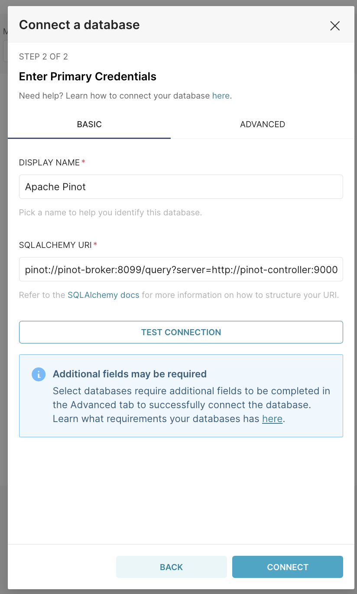

# RealTimeDataHub

RealTimeDataHub is a real-time data warehouse from scratch using technologies like Apache Airflow, Apache Pinot, Redpanda, PostgreSQL, and Apache Superset. The goal of this project is to enable real-time data analytics, ensuring businesses can make instantaneous decisions based on live data streams.

## Table of Contents

- [Project Overview](#project-overview)
- [Architecture](#architecture)
- [Tech Stack](#tech-stack)
- [Features](#features)
- [Installation](#installation)
- [Usage](#usage)
- [Contributing](#contributing)
- [License](#license)

## Project Overview

In today's data-driven world, businesses require real-time insights to stay competitive. Traditional batch processing is no longer sufficient for timely decision-making. RealTimeDataHub solves this by implementing a real-time data warehouse that processes streaming data from a simulated financial institution and visualizes it using Apache Superset.

## Architecture

The architecture of RealTimeDataHub consists of the following components:

- **Apache Airflow**: Orchestrates the data pipeline, using Directed Acyclic Graphs (DAGs) to manage workflows.
- **PostgreSQL**: Stores raw and processed data.
- **Apache Pinot**: Handles real-time data analytics, ingesting data from Redpanda.
- **Redpanda**: A Kafka-compatible streaming data platform built for data-intensive applications.
- **Apache Superset**: Provides real-time data visualization and dashboarding capabilities.



## Tech Stack

- **Apache Airflow**: Data pipeline orchestration.
- **PostgreSQL**: Database for storing relational data.
- **Apache Pinot**: Real-time OLAP datastore for low-latency analytics.
- **Redpanda**: High-throughput streaming platform.
- **Apache Superset**: Data visualization and dashboarding.
- **Docker**: Containerized deployment of all services.
- **Python**: Backend scripting and DAGs for Apache Airflow.

## Features

- Real-time data ingestion and streaming from a simulated financial institution.
- Real-time analytics powered by Apache Pinot.
- Data orchestration and ETL processes managed by Apache Airflow.
- Interactive data dashboards and visualizations using Apache Superset.
- Streamlined, containerized deployment using Docker.

## Installation

1. **Clone the repository**:

   ```bash
   git clone https://github.com/ajosegun/RealTimeDataHub.git
   cd RealTimeDataHub
   ```

2. **Install dependencies**:
   Ensure you have Docker and Docker Compose installed. Once you do, run the following command to start the services:

   ```bash
   docker-compose up --build
   ```

3. **Access services**:

   - **Airflow**: `http://localhost:8081`
   - **Superset**: `http://localhost:8088`
   - **Redpanda**: `http://localhost:8080`
   - **Pinot**: `http://localhost:9000`

4. **Run the initial setup**:
   Initialize the Airflow environment, databases, and schemas:

   ```bash
   docker exec -it airflow-webserver airflow db init
   ```

5. Apache Superset
   Add Pinot as a database
   `pinot://pinot-broker:8099/query?server=http://pinot-controller:9000/`

   

   Create a new dashboard and add the following query

   ```sql
       SELECT
       tf.*,
       cd.first_name || ' ' || cd.last_name AS full_name,
       email,
       phone_number,
       registration_date,
       branch_name,
       branch_address,
       city,
       state,
       zipcode,
       account_type,
       status,
       balance
   FROM
       transaction_facts tf
   LEFT JOIN
       account_dim ad ON tf.account_id = ad.account_id
   LEFT JOIN
       customer_dim cd ON tf.customer_id = cd.customer_id
   LEFT JOIN
       branch_dim bd ON tf.branch_id = bd.branch_id;
   ```
